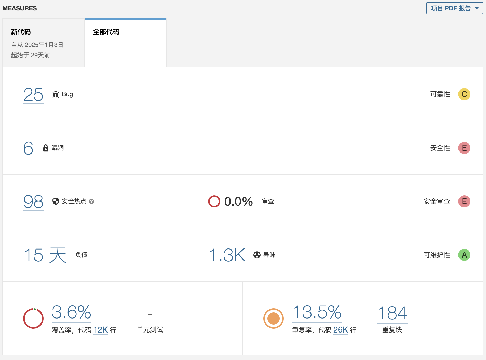

## jaocoo报告抓取

本项目需要工作在K8s环境内，通过jacoco agent项目来dump java项目的测试覆盖率。并通过pod上的git commit值来下载对应的代码生成覆盖率报告。
最终报告会上传到minio的对象存储中。
通过以上方案可以节省开发人员书写单元测试，并可以观测自动/功能的测试覆盖业务情况。

抓取整体分为如下几个流程

1. 对java项目进行打桩:
    方法是下载，jacoco-agent。在java项目启动时的进行注入。推荐的一个启动参数 -javaagent:org.jacoco.agent-runtime.jar=output=tcpserver,address=* 主要修改output参数为tcp方便下一步的集中抓取.并修改address为*可以在任意请求来源
2. 对POD增加相应的注解：
    本步的主要作用是让抓取器知道本POD已经打开了，jacoco server模式。同时告知抓取器本POD对应的源码URL和commit值，以让抓取器去抓取代码生成覆盖率报告
    ~~~ yaml
    <!-- 标记是否开启jacoco -->
    jacoco/enable: true
    <!-- 源码地址 -->
    jacoco/git-url: https://github.com/guohai163/java-sql-web.git
    <!-- 非必须参数，如果本pod对应的代码不在根目录。需要增加此参数 -->
    jacoco/src-path: code-pom-path
    <!-- commit值 -->
    jacoco/git-commit: 3a3fd777c9a652765730ec8d85b970f6d4c4e271
    ~~~
3. 在k8s内启动本项目：
   推荐使用helm来启动本项目。需要准备好 minio的环境,新建一个名为jacoco-report的存储桶并生成好对应 的key。同时本项目会在K8s集群内创建一个服务账号用来请求集群内的注解权限。
   ~~~ shell
    kubectl create ns jacoco-report
    helm repo add jacoco-report https://guohai163.github.io/jacoco-report 
    helm repo update
    helm upgrade --install jacoco-report jacoco-report/jacoco-report \
        --set 'extraEnvs[0].name=MINIO_URL,extraEnvs[0].value=minio.xxx.x' \
        --set 'extraEnvs[1].name=MINIO_ACCESS,extraEnvs[1].value=xxx' \
        --set 'extraEnvs[2].name=MINIO_SECRET,extraEnvs[2].value=xxx'
   ~~~
   正常启动后，项目会在每日凌晨1点对k8s内项目进行扫描并生成结果到存储桶内。
4. xml报告的使用
    最终生成的报告建议配合SonarQube来使用，可以查看代码BUG同时能看到测试的覆盖情况
    

## 相关资料

* [jacoco官网](https://www.jacoco.org/)